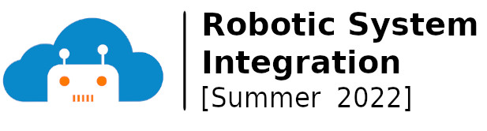

  
  Course materials licensed under <a href="https://creativecommons.org/licenses/by-nc/4.0/">CC BY-NC 4.0</a>

# Academic Courses
## [COSC 310 Data Structures](4-courses/COSC310-2026-Spring)
The course reviews object-oriented design and discusses algorithm complexity, Big-O notation, and tractable and intractable algorithms. The course introduces concepts of abstract data types, basic data structures (i.e., lists, stacks, queues, and trees), and advanced data structures (i.e., graphs, sets, and heap). It also presents fundamental computing algorithms, including sorting, searching, and graph algorithms. See [Spring 2026](4-courses/COSC310-2026-Spring) material.

## [ROBO 201 Motion Planning Algorithms for Robotics](4-courses/ROBO201-2025-Fall)
This course provides knowledge on path planning algorithms for autonomous robot navigation within the context of the Robotics Operating System (ROS). Students explore examples relevant to both mobile and manipulator robots. The course covers the representation of robot environment using configuration space, the construction of occupancy grid maps of obstacles, and the utilization of these maps for path planning. See [Fall 2025](4-courses/ROBO201-2025-Fall) material.

## [ROBO 202 Software Development for Robotics](4-courses/ROBO202-2025-Fall)
This course offers a comprehensive introduction to robotics software development. Students learn how to employ widely adopted programming tools in robotics, including the Robotics Operating System (ROS), enabling students to apply techniques related to the physical embodiment of robots. See [Fall 2025](4-courses/ROBO202-2025-Fall) material.

# Tutorials & Workshops

## [Robotic System Integration](https://avlab.io/robotic-sys-integration-course/)

July 13 - July 22 Summer 2022  
_Designed and delivered by Eyad Shakab, Arjun Sharma, and Dr. Majid Khonji_ 

This high-level course teaches the basics of system integration using Linux OS and Robot Operating System (ROS). The objective is to build technical maturity and problem-solving skills to deal with diverse software efficiently and in a timely manner to get the task done. The course targets audiences from computer science (CS) backgrounds as well as those from other engineering disciplines as long as they are curious to learn beyond the instructions provided. For CS majors, the course will be more like a revision of basics but at the same time integrates different approaches that the student might not have been exposed to together.
[See course material.](https://avlab.io/robotic-sys-integration-course/)
