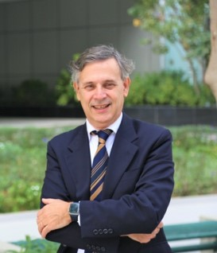
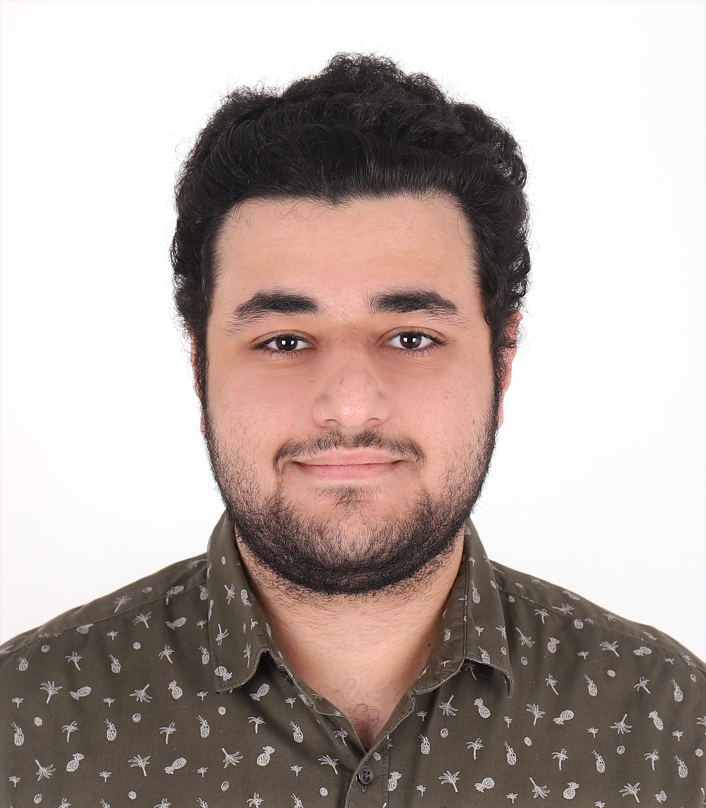
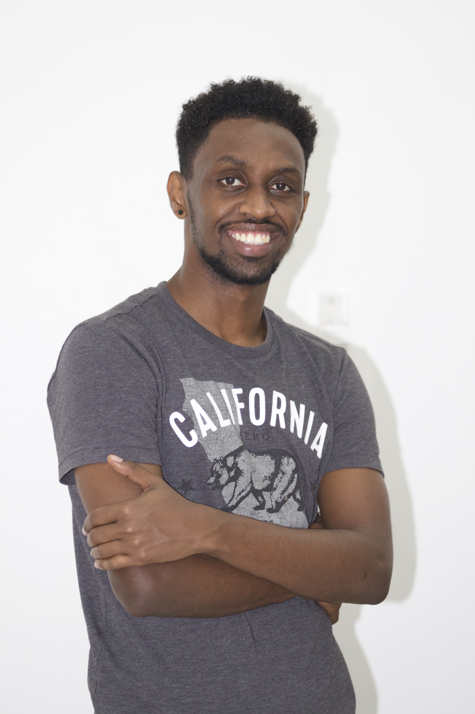
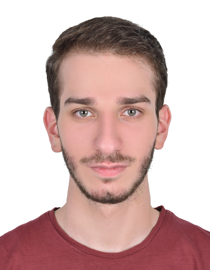
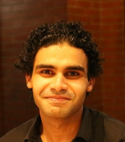

# Faculty

**Dr. Majid Khonji**

Dr. Majid Khonji is an Assistant Professor in the Computer Science Department at Khalifa University (KU). He leads the research activities in the Autonomous Vehicle Laboratory at the KU Center for Autonomous Robotic Systems (KUCARS). Additionally, he is a research affiliate with the MIT Computer Science and Artificial Intelligence Laboratory (CSAIL) in the USA. Dr. Khonji earned his MSc degree in Security, Cryptology, and Coding of Information Systems from Ensimag, Grenoble Institute of Technology, France, and completed his Ph.D. in Interdisciplinary Engineering at Masdar Institute, in collaboration with MIT, in 2016.
Prior to his current role, he was a visiting assistant professor at MIT's CSAIL, a senior R&D technologist at Dubai Electricity and Water Authority (DEWA), and an information security researcher at the Emirates Advanced Investment Group (EAIG).
His research interests include Probabilistic Planning, Artificial Intelligence, Combinatorial Optimization, Autonomous Vehicles, and Electric Mobility.

Email: majid.khonji(at)ku.ac.ae

**Prof. Jorge Dias**

Jorge Dias has a Ph.D. in EE and Coordinates the Artificial Perception Group from the Institute of Systems and Robotics from the University of Coimbra, Portugal. He is Full Professor at Khalifa University, Abu Dhabi, UAE and Deputy Director from the Center of Autonomous Robotic Systems from Khalifa University. His expertise is in the area of Artificial Perception (Computer Vision and Robotic Vision) and has contributions on the field since 1984. He has been principal investigator and consortia coordinator from several research international projects, and coordinates the research group on Computer Vision and Artificial Perception from KUCARS.
Jorge Dias published several articles in the area of Computer Vision and Robotics that include more than 300 publications in international journals and conference proceedings and recently published book on Probabilistic Robot Perception that addresses the use of statistical modeling and Artificial Intelligence for Perception, Planning and Decision in Robots. He was the Project Coordinator of two European Consortium for the Projects "Social Robot" and "GrowMeUP" that were developed to support the inclusivity and wellbeing for of the Elderly generation.

Email: jorge.dias(at)ku.ac.ae

----

# Research Staff

**Dr. Sumbal Malik**
> Postdoctoral Fellow

Dr. Sumbal Malik is currently a Postdoctoral Fellow at Khalifa University, where she focuses on multiagent coordination. She received her PhD in Computer Science from United Arab Emirates University in 2024. Her research interests encompass a wide range of topics, including collaborative autonomous driving, transportation, and machine learning.
Throughout her PhD research, Sumbal authored over 20 articles in reputable journals and conferences, including publications in journals ranked in the top 1%, 5%, 10%, and 25%, demonstrating the high impact of her work.
Before joining UAEU, Sumbal earned a Master of Science degree in Computer Science from the University of Gujrat, Pakistan, where she was awarded a Gold Medal for her outstanding performance. During her master's studies, she specialized in natural language processing and biomedical information retrieval for clinicians in healthcare settings, honing her expertise in these domains.

**Mohammad Riyadh Alkharrat**
> Researche Assistant

Riyadh is a researcher in the autonomous vehicle lab at Khalifa University, specializing in robotics simulations and system integrations. He is dedicated to advancing the fields of autonomous vehicles and robotics. He is currently working on the development of an autonomous shuttle, focusing on components such as control, localization, planning, and perception to create a self-driving vehicle. His experience includes working on the implementation of autonomous navigation stacks on various UGVs, and the development of a virtual passengers' assistant in autonomous vehicles. Furthermore, Riyadh received his Bachelor of Computer Engineering degree from the University of Wollongong in Dubai.

**Murad Mebrahtu**
>Research Associate

Murad Smreteab received his Bachelor of Science in Computer Engineering from Khalifa University with the highest honors in January 2021, and master’s degree in computer science at Khalifa University in 2023. His main areas of research are Machine learning, Deep learning, and Autonomous driving. His master’s thesis is focused on pedestrian behavior prediction and safe navigation around pedestrians. Murad is a member of IEEE Eta Kappa Nu at Khalifa university since 2018 and a member of the Golden Key honor society since 2020. Outside the classroom, he occasionally participates in competitions. In 2018, he won second place in the National Huawei ICT competition in UAE and represented the UAE in the middle east ICT competition. Moreover, he won third place in capture the flag group competition in UAE. As an intern, he worked at Gamalearn as Microsoft PowerApps and flow developer. He also has experience as a teaching assistant at khalifa university working as a primary C++ lab instructor and assistant data structures lab instructor. Outside academia  he is actively involved in sports, representing Khalifa university both in football and volleyball.  In his free time he enjoys playing sports and watching movies.

Email: Murad.Mebrahtu(at)ku.ac.ae

**Yousef Babaa**
> Research Visitor

Yousef received his Bachelor of Science in Electrical Engineering - Mechatronics with merit Summa Cum Laude at the Canadian University of Dubai. As an Electrical & Robotics Engineer and Instructor at STEMA, he instructed students in engineering, programming, and robotics. Notably, he created a curriculum for a Unity 2D game design training program and supervised 30 interns. Yousef's research interests lie in autonomous and electric vehicles, and he contributed to a solar-powered electric autonomous vehicle during his graduation project. As a visiting researcher at the AV Lab, he plays a role in integrating components into the gen0 vehicle, and managing lab equipment & operations.

# Visitors
---
# Graduate Students

**Nadya Abdel Madjid** 
>PhD Student; joined Fall 2022; funded under KUCARS Theme 1

Nadya Abdel Madjid received the Bachelor’s Degree in applied mathematics and Computer Science from Lomonosov Moscow State University and the Masters degree through the research and teaching assistant scholarship from the Khalifa University of Science and Technology in 2020. Her Master's thesis research was conducted as a part of the group project aiming on creating an EIT-based flexible tactile sensor to equip robots with sensing capability and artificial skin. Nadya's part was to design an object recognition algorithm for the sensor. In 2021, Nadya joined as a Research Assistant in the division of Computer Science at New York University Abu Dhabi. There her research was focused on Question Answering over Knowledge Graphs. In 2022, Nadya joined Khalifa University as a PhD student and in January 2023, she joined the AV lab. Currently her research is related to multi-agent systems.  

**Mohammed Nagy** 
>PhD Student; joined Spring 2023; funded under KUCARS Theme 1

Mohamed Nagy received a B.S. (2018) in mathematics and computer science from Helwan University, Egypt, and he is recently pursuing an MSc in computer science at Khalifa University, UAE. As part of his career journey, he has been a teaching assistant at Helwan University since 2018 and joined Udacity as a mentor in 2020. His research and teaching concentrate on algorithms, deep learning, and perception for autonomous vehicles. In 2016, he joined the "Mobile Application Launchpad" program by Google, followed by internships and scholarships from leading companies and government entities, namely, Google, Facebook, Udacity, and the Ministry of Communications and Information Technology (MCIT) of Egypt. In 2018, he voluntarily contributed as an Android tutor in One Million Arab Coders, a global initiative, and was cited as one of the best tutors by the Dubai Future Foundation.
His research interests include object tracking, autonomous systems perception, sensor fusion, and deep learning.

Email: mohamed.nagy(at)ku.ac.ae

**Abdulrahman Hamdy Ahmad** 
>PhD Student; joined Spring 2023; funded under KUCARS Theme 1

(Student Member, IEEE) received the B.Sc. degree (Hons.) in computer and systems engineering from Minia University, Minia, Egypt, in 2016,  M.Sc in Electrical and Computer Engineering from Khalifa University of Science  and Technology, Abu Dhabi, UAE, in 2023 and he is pursuing his Ph.D degree in Electrical Engineering and Computer Science besides joining the Autonomous Vehicles Lab from Khalifa University, Abu Dhabi, UAE.  He is on a leave from 2021 till now from the college of engineering, Minia University,  Egypt, as a faculty member.  His main research interests include motion planning of autonomous vehicles,  end-to-end autonomous driving, optimization, machine learning, and intelligent transportation systems.

**Abdelmoamen Nasser** 
>PhD Student; joined Spring 2024; funded under KUCARS Theme 1

Abdelmoamen Nasser received his BSc. in Electrical Engineering from Abu Dhabi University in 2018 with a focus in power systems and renewable energy, and received his MSc. in Electrical Engineering from United Arab Emirates University in 2022 focused on control and artificial intelligence. He is currently pursuing a Ph.D. in Engineering with a robotics concentration. Simultaneous to his studies, he developed interests in web development leading to participation in the first Food Security Hackathon. Additionally, he was in the winning team at the "Youth Hackathon on the Energy Sector in the UAE" organized by the French Institute. Prior to starting his Ph.D., he worked at the Lockheed Martin Center for Innovation and Security Solutions as an A.I. and robotics intern where he gained industry specific experience and eventually leading other intern teams in development and presentation of the CISS projects to VIP guests at multiple tradeshows.

**Many thanks to [AV Lab Alumni](5-team/alumni)** for their great contributions.

