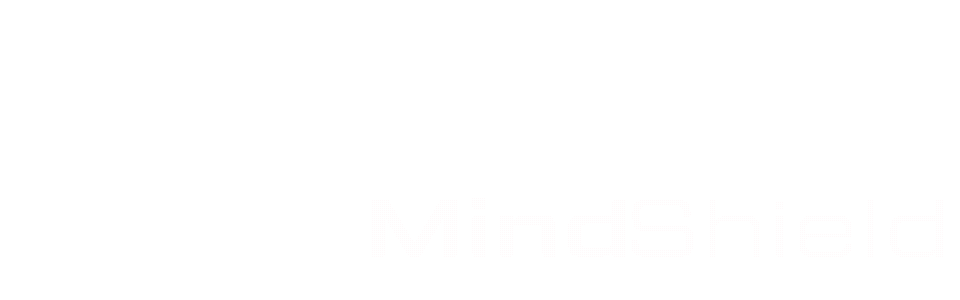

---
# To modify the layout, see https://jekyllrb.com/docs/themes/#overriding-theme-defaults

layout: home
---

 
    <h1 class='av-title typewriter'>
      
    </h1> 
    
 
      
    
 
    
 
      <a href="https://kb.avlab.io" target="_blank">
      <video autoplay muted loop >
        <source src="assets/kb-video.mp4" type="video/mp4">
      </video>
      </a>
    
 

 

  

SAFETY-CRITICAL AUTONOMY
    At <a href="https://ku.ac.ae">Khalifa University</a>, we study safe autonomy under realistic uncertainty and deployment constraints, combining formal methods and real-world validation for safety-critical systems.
  

  

  Research Focus
  <ul>
    <li><strong>Decision-making safety:</strong> Formal analysis of autonomous decision pipelines, including failure modes, safety guarantees, and verification under uncertainty.</li>
    <li><strong>Multi-agent coordination:</strong> Coordination and information sharing under uncertainty, including communication constraints and trust assumptions.</li>
    <li><strong>Risk-bounded planning:</strong> Planning and control methods that explicitly encode risk, enabling safety guarantees rather than empirical tuning.</li>
  </ul>
<!--.	  -->
  

  

  

    

  

